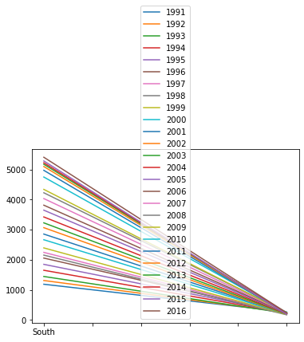
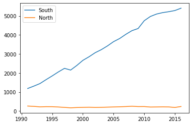
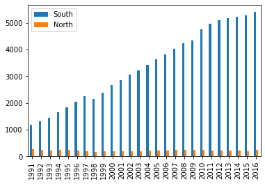
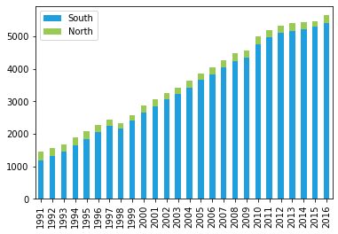
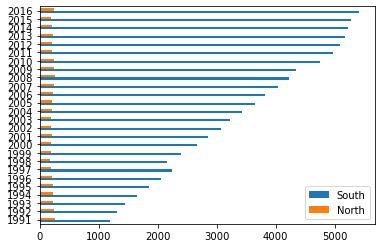
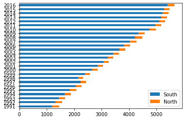
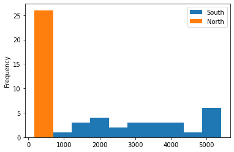
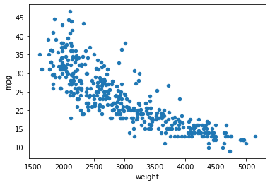
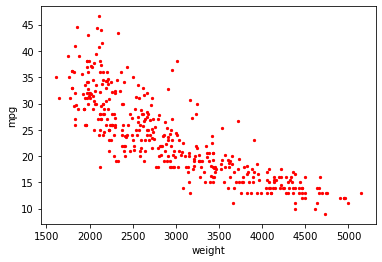
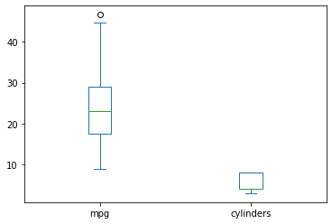

### PART3. 데이터 살펴보기

#### 데이터프레임의 구조


```python
import pandas as pd

df = pd.read_csv('./auto-mpg.csv', header=None)

df.columns = ['mpg','cylinders','displacement','horsepower','weight',
              'acceleration','model year','origin','name']
```


```python
df.head()
```


<div>
<style scoped>
    .dataframe tbody tr th:only-of-type {
        vertical-align: middle;
    }

    .dataframe tbody tr th {
        vertical-align: top;
    }

    .dataframe thead th {
        text-align: right;
    }
</style>
<table border="1" class="dataframe">
  <thead>
    <tr style="text-align: right;">
      <th></th>
      <th>mpg</th>
      <th>cylinders</th>
      <th>displacement</th>
      <th>horsepower</th>
      <th>weight</th>
      <th>acceleration</th>
      <th>model year</th>
      <th>origin</th>
      <th>name</th>
    </tr>
  </thead>
  <tbody>
    <tr>
      <th>0</th>
      <td>18.0</td>
      <td>8</td>
      <td>307.0</td>
      <td>130.0</td>
      <td>3504.0</td>
      <td>12.0</td>
      <td>70</td>
      <td>1</td>
      <td>chevrolet chevelle malibu</td>
    </tr>
    <tr>
      <th>1</th>
      <td>15.0</td>
      <td>8</td>
      <td>350.0</td>
      <td>165.0</td>
      <td>3693.0</td>
      <td>11.5</td>
      <td>70</td>
      <td>1</td>
      <td>buick skylark 320</td>
    </tr>
    <tr>
      <th>2</th>
      <td>18.0</td>
      <td>8</td>
      <td>318.0</td>
      <td>150.0</td>
      <td>3436.0</td>
      <td>11.0</td>
      <td>70</td>
      <td>1</td>
      <td>plymouth satellite</td>
    </tr>
    <tr>
      <th>3</th>
      <td>16.0</td>
      <td>8</td>
      <td>304.0</td>
      <td>150.0</td>
      <td>3433.0</td>
      <td>12.0</td>
      <td>70</td>
      <td>1</td>
      <td>amc rebel sst</td>
    </tr>
    <tr>
      <th>4</th>
      <td>17.0</td>
      <td>8</td>
      <td>302.0</td>
      <td>140.0</td>
      <td>3449.0</td>
      <td>10.5</td>
      <td>70</td>
      <td>1</td>
      <td>ford torino</td>
    </tr>
  </tbody>
</table>
</div>


```python
df.tail()
```


<div>
<style scoped>
    .dataframe tbody tr th:only-of-type {
        vertical-align: middle;
    }

    .dataframe tbody tr th {
        vertical-align: top;
    }

    .dataframe thead th {
        text-align: right;
    }
</style>
<table border="1" class="dataframe">
  <thead>
    <tr style="text-align: right;">
      <th></th>
      <th>mpg</th>
      <th>cylinders</th>
      <th>displacement</th>
      <th>horsepower</th>
      <th>weight</th>
      <th>acceleration</th>
      <th>model year</th>
      <th>origin</th>
      <th>name</th>
    </tr>
  </thead>
  <tbody>
    <tr>
      <th>393</th>
      <td>27.0</td>
      <td>4</td>
      <td>140.0</td>
      <td>86.00</td>
      <td>2790.0</td>
      <td>15.6</td>
      <td>82</td>
      <td>1</td>
      <td>ford mustang gl</td>
    </tr>
    <tr>
      <th>394</th>
      <td>44.0</td>
      <td>4</td>
      <td>97.0</td>
      <td>52.00</td>
      <td>2130.0</td>
      <td>24.6</td>
      <td>82</td>
      <td>2</td>
      <td>vw pickup</td>
    </tr>
    <tr>
      <th>395</th>
      <td>32.0</td>
      <td>4</td>
      <td>135.0</td>
      <td>84.00</td>
      <td>2295.0</td>
      <td>11.6</td>
      <td>82</td>
      <td>1</td>
      <td>dodge rampage</td>
    </tr>
    <tr>
      <th>396</th>
      <td>28.0</td>
      <td>4</td>
      <td>120.0</td>
      <td>79.00</td>
      <td>2625.0</td>
      <td>18.6</td>
      <td>82</td>
      <td>1</td>
      <td>ford ranger</td>
    </tr>
    <tr>
      <th>397</th>
      <td>31.0</td>
      <td>4</td>
      <td>119.0</td>
      <td>82.00</td>
      <td>2720.0</td>
      <td>19.4</td>
      <td>82</td>
      <td>1</td>
      <td>chevy s-10</td>
    </tr>
  </tbody>
</table>
</div>


```python
# df의 모양과 크기 확인(행의 개수, 열의 개수)를 튜플로 반환
print(df.shape)
```

    (398, 9)
    


```python
# 데이터프레임 df의 내용 확인
print(df.info())
```

    <class 'pandas.core.frame.DataFrame'>
    RangeIndex: 398 entries, 0 to 397
    Data columns (total 9 columns):
     #   Column        Non-Null Count  Dtype  
    ---  ------        --------------  -----  
     0   mpg           398 non-null    float64
     1   cylinders     398 non-null    int64  
     2   displacement  398 non-null    float64
     3   horsepower    398 non-null    object 
     4   weight        398 non-null    float64
     5   acceleration  398 non-null    float64
     6   model year    398 non-null    int64  
     7   origin        398 non-null    int64  
     8   name          398 non-null    object 
    dtypes: float64(4), int64(3), object(2)
    memory usage: 28.1+ KB
    None
    


```python
# 데이터프레임 df의 기술 통계 정보 확인
print(df.describe())
print('\n')
print(df.describe(include='all'))
```

                  mpg   cylinders  displacement       weight  acceleration  \
    count  398.000000  398.000000    398.000000   398.000000    398.000000   
    mean    23.514573    5.454774    193.425879  2970.424623     15.568090   
    std      7.815984    1.701004    104.269838   846.841774      2.757689   
    min      9.000000    3.000000     68.000000  1613.000000      8.000000   
    25%     17.500000    4.000000    104.250000  2223.750000     13.825000   
    50%     23.000000    4.000000    148.500000  2803.500000     15.500000   
    75%     29.000000    8.000000    262.000000  3608.000000     17.175000   
    max     46.600000    8.000000    455.000000  5140.000000     24.800000   
    
           model year      origin  
    count  398.000000  398.000000  
    mean    76.010050    1.572864  
    std      3.697627    0.802055  
    min     70.000000    1.000000  
    25%     73.000000    1.000000  
    50%     76.000000    1.000000  
    75%     79.000000    2.000000  
    max     82.000000    3.000000  
    
    
                   mpg   cylinders  displacement horsepower       weight  \
    count   398.000000  398.000000    398.000000        398   398.000000   
    unique         NaN         NaN           NaN         94          NaN   
    top            NaN         NaN           NaN      150.0          NaN   
    freq           NaN         NaN           NaN         22          NaN   
    mean     23.514573    5.454774    193.425879        NaN  2970.424623   
    std       7.815984    1.701004    104.269838        NaN   846.841774   
    min       9.000000    3.000000     68.000000        NaN  1613.000000   
    25%      17.500000    4.000000    104.250000        NaN  2223.750000   
    50%      23.000000    4.000000    148.500000        NaN  2803.500000   
    75%      29.000000    8.000000    262.000000        NaN  3608.000000   
    max      46.600000    8.000000    455.000000        NaN  5140.000000   
    
            acceleration  model year      origin        name  
    count     398.000000  398.000000  398.000000         398  
    unique           NaN         NaN         NaN         305  
    top              NaN         NaN         NaN  ford pinto  
    freq             NaN         NaN         NaN           6  
    mean       15.568090   76.010050    1.572864         NaN  
    std         2.757689    3.697627    0.802055         NaN  
    min         8.000000   70.000000    1.000000         NaN  
    25%        13.825000   73.000000    1.000000         NaN  
    50%        15.500000   76.000000    1.000000         NaN  
    75%        17.175000   79.000000    2.000000         NaN  
    max        24.800000   82.000000    3.000000         NaN  
    


```python
# 데이터프레임 df의 각 열이 가지고 있는 원소 개수 확인
print(df.count())
print('\n')
```

    mpg             398
    cylinders       398
    displacement    398
    horsepower      398
    weight          398
    acceleration    398
    model year      398
    origin          398
    name            398
    dtype: int64
    
    
    


```python
# df.count()가 반환하는 객체 타입 출력
print(type(df.count()))
```

    <class 'pandas.core.series.Series'>
    


```python
# 데이터프레임 df의 특정 열이 가지고 있는 고유값 확인
unique_values = df['origin'].value_counts()
print(unique_values)
print('\n')

# value_counts 메소드가 반환하는 객체 타입 출력
print(type(unique_values))
```

    1    249
    3     79
    2     70
    Name: origin, dtype: int64
    
    
    <class 'pandas.core.series.Series'>
    

##### 통계함수 적용


```python
# 평균값
print(df.mean())
```

    mpg               23.514573
    cylinders          5.454774
    displacement     193.425879
    weight          2970.424623
    acceleration      15.568090
    model year        76.010050
    origin             1.572864
    dtype: float64
    

    C:\Users\gram\AppData\Local\Temp\ipykernel_6160\4060634892.py:2: FutureWarning: Dropping of nuisance columns in DataFrame reductions (with 'numeric_only=None') is deprecated; in a future version this will raise TypeError.  Select only valid columns before calling the reduction.
      print(df.mean())
    


```python
# 중간값
print(df.median())
```

    mpg               23.0
    cylinders          4.0
    displacement     148.5
    weight          2803.5
    acceleration      15.5
    model year        76.0
    origin             1.0
    dtype: float64
    

    C:\Users\gram\AppData\Local\Temp\ipykernel_6160\2901594332.py:2: FutureWarning: Dropping of nuisance columns in DataFrame reductions (with 'numeric_only=None') is deprecated; in a future version this will raise TypeError.  Select only valid columns before calling the reduction.
      print(df.median())
    


```python
# 최대값
print(df.max())
```

    mpg                         46.6
    cylinders                      8
    displacement               455.0
    horsepower                     ?
    weight                    5140.0
    acceleration                24.8
    model year                    82
    origin                         3
    name            vw rabbit custom
    dtype: object
    


```python
# 최소값
print(df.min())
```

    mpg                                 9.0
    cylinders                             3
    displacement                       68.0
    horsepower                        100.0
    weight                           1613.0
    acceleration                        8.0
    model year                           70
    origin                                1
    name            amc ambassador brougham
    dtype: object
    


```python
# 표준편차
print(df.std())
```

    mpg               7.815984
    cylinders         1.701004
    displacement    104.269838
    weight          846.841774
    acceleration      2.757689
    model year        3.697627
    origin            0.802055
    dtype: float64
    

    C:\Users\gram\AppData\Local\Temp\ipykernel_6160\3416470948.py:2: FutureWarning: Dropping of nuisance columns in DataFrame reductions (with 'numeric_only=None') is deprecated; in a future version this will raise TypeError.  Select only valid columns before calling the reduction.
      print(df.std())
    


```python
# 상관계수
print(df.corr())
```

                       mpg  cylinders  displacement    weight  acceleration  \
    mpg           1.000000  -0.775396     -0.804203 -0.831741      0.420289   
    cylinders    -0.775396   1.000000      0.950721  0.896017     -0.505419   
    displacement -0.804203   0.950721      1.000000  0.932824     -0.543684   
    weight       -0.831741   0.896017      0.932824  1.000000     -0.417457   
    acceleration  0.420289  -0.505419     -0.543684 -0.417457      1.000000   
    model year    0.579267  -0.348746     -0.370164 -0.306564      0.288137   
    origin        0.563450  -0.562543     -0.609409 -0.581024      0.205873   
    
                  model year    origin  
    mpg             0.579267  0.563450  
    cylinders      -0.348746 -0.562543  
    displacement   -0.370164 -0.609409  
    weight         -0.306564 -0.581024  
    acceleration    0.288137  0.205873  
    model year      1.000000  0.180662  
    origin          0.180662  1.000000  
    


```python
df = pd.read_excel('./남북한발전전력량.xlsx')

df_ns = df.iloc[[0,5],3:]                # 남한, 북한 발전량 합계 데이터만 추출
df_ns.index = ['South','North']          # 행 인덱스 변경
df_ns.columns = df_ns.columns.map(int)   # 열 이름의 자료형을 정수형으로 변경
print(df_ns.head())
print('\n')

df_ns.plot()
```

           1991  1992  1993  1994  1995  1996  1997  1998  1999  2000  ...  2007  \
    South  1186  1310  1444  1650  1847  2055  2244  2153  2393  2664  ...  4031   
    North   263   247   221   231   230   213   193   170   186   194  ...   236   
    
           2008  2009  2010  2011  2012  2013  2014  2015  2016  
    South  4224  4336  4747  4969  5096  5171  5220  5281  5404  
    North   255   235   237   211   215   221   216   190   239  
    
    [2 rows x 26 columns]
    
    
    


    <AxesSubplot:>


    

    


```python
# 행, 열 전치하여 다시 그리기
tdf_ns = df_ns.T
print(tdf_ns.head())
print('\n')
tdf_ns.plot()
```

         South North
    1991  1186   263
    1992  1310   247
    1993  1444   221
    1994  1650   231
    1995  1847   230
    
    
    


    <AxesSubplot:>


    

    


```python
df = pd.read_excel('./남북한발전전력량.xlsx')

df_ns = df.iloc[[0,5],3:]                # 남한, 북한 발전량 합계 데이터만 추출
df_ns.index = ['South','North']          # 행 인덱스 변경
df_ns.columns = df_ns.columns.map(int)   # 열 이름의 자료형을 정수형으로 변경

# 행, 열 전치하여 막대 그래프 그리기
tdf_ns = df_ns.T
tdf_ns.plot(kind='bar')
```


    <AxesSubplot:>


    

    


```python
# 누적 막대그래프
tdf_ns.plot(kind='bar', color=['#209FDF','#99CA53'], stacked=True)
```


    <AxesSubplot:>


    

    


```python
# 가로 막대 그래프
tdf_ns.plot(kind='barh')
```


    <AxesSubplot:>


    

    


```python
# 가로 누적 막대 그래프
tdf_ns.plot(kind='barh', stacked=True)
```


    <AxesSubplot:>


    

    


```python
df = pd.read_excel('./남북한발전전력량.xlsx')

df_ns = df.iloc[[0,5],3:]                # 남한, 북한 발전량 합계 데이터만 추출
df_ns.index = ['South','North']          # 행 인덱스 변경
df_ns.columns = df_ns.columns.map(int)   # 열 이름의 자료형을 정수형으로 변경

# 행, 열 전치하여 히스토그램 그리기
tdf_ns = df_ns.T
tdf_ns = tdf_ns.astype(float)
tdf_ns.plot(kind='hist')
```


    <AxesSubplot:ylabel='Frequency'>


    

    


```python
import pandas as pd

df = pd.read_csv('./auto-mpg.csv')

# 열 이름 지정
df.columns = ['mpg','cylinders','displacement','horsepower','weight',
              'acceleration','model year','origin','name']

# 2개의 열 선택하여 산점도 그리기
df.plot(x='weight',y='mpg',kind='scatter')
```


    <AxesSubplot:xlabel='weight', ylabel='mpg'>


    

    


```python
# 점의 색과 크기 설정
df.plot(x='weight',y='mpg',kind='scatter',color='red',s=5)
```


    <AxesSubplot:xlabel='weight', ylabel='mpg'>


    

    


```python
# 열을 선택하여 박스 플롯 그리기
df[['mpg','cylinders']].plot(kind='box')
```


    <AxesSubplot:>


    

    


```python
df.plot(kind='box',y=['mpg','cylinders'])
```


    <AxesSubplot:>


    

    

