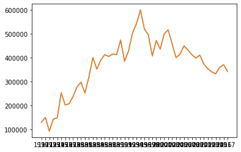
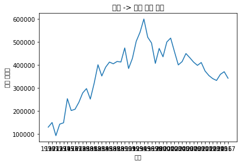
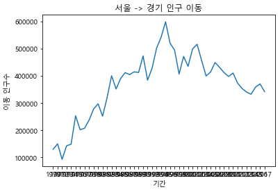
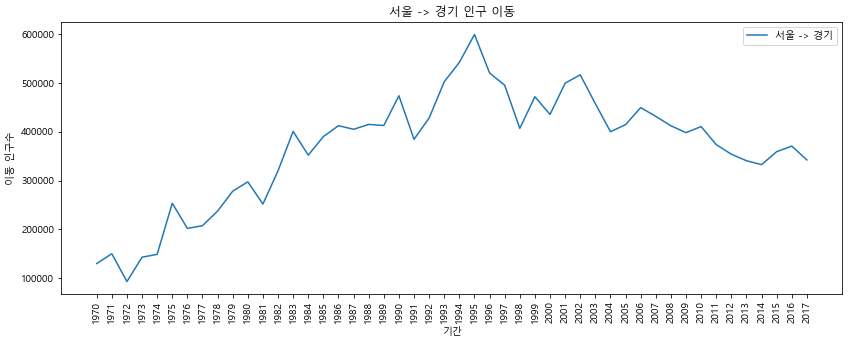
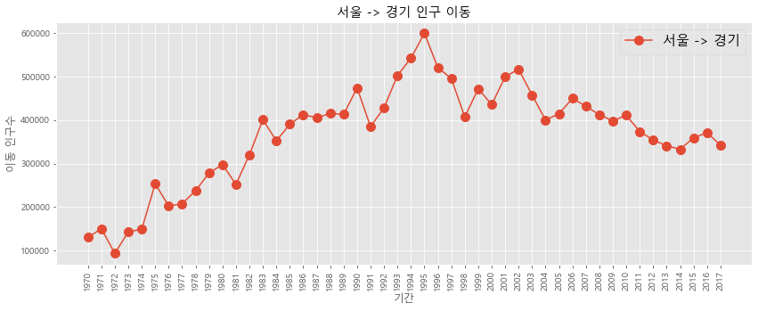
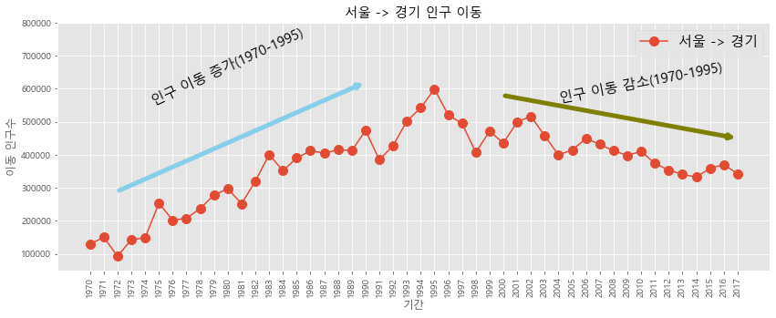
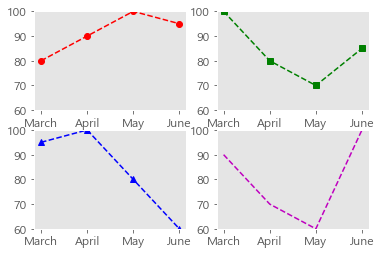
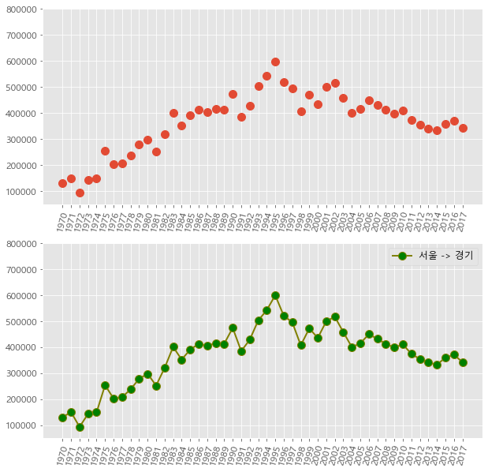

```python
import matplotlib.pyplot as plt
import pandas as pd

# Excel 데이터를 데이터프레임으로 변환
df=pd.read_excel("시도별 전출입 인구수.xlsx", header=0);
```


```python
# 누락값(NaN)을 앞 데이터로 채움(엑셀 양식 병합 부분)
df = df.fillna(method='ffill')

# 서울에서 다른 지역으로 이동한 데이터만 추출하여 정리
mask = (df['전출지별'] == '서울특별시') & (df['전입지별'] != '서울특별시')
df_seoul = df[mask]
df_seoul = df_seoul.drop(['전출지별'], axis=1)
df_seoul.rename({'전입지별':'전입지'}, axis=1, inplace=True)
df_seoul.set_index('전입지', inplace=True)
```


```python
# 서울에서 경기도로 이동한 인구 데이터 값만 선택
sr_one = df_seoul.loc['경기도']
```


```python
# x축, y축 데이터를 plot 함수에 입력
plt.plot(sr_one.index, sr_one.values)

# 판다스 객체를 plot 함수에 입력
plt.plot(sr_one)
```


    [<matplotlib.lines.Line2D at 0x1cb424f4340>]


    

    


```python
sr_one = df_seoul.loc['경기도']

plt.plot(sr_one.index, sr_one.values)

# 차트 제목 추가
plt.title('서울 -> 경기 인구 이동')

# 축 이름 추가
plt.xlabel('기간')
plt.ylabel('이동 인구수')

# 변경사항 저장하고 그래프 출력
plt.show()
```

    C:\Users\gram\anaconda3\lib\site-packages\IPython\core\pylabtools.py:151: UserWarning: Glyph 49436 (\N{HANGUL SYLLABLE SEO}) missing from current font.
      fig.canvas.print_figure(bytes_io, **kw)
    C:\Users\gram\anaconda3\lib\site-packages\IPython\core\pylabtools.py:151: UserWarning: Glyph 50872 (\N{HANGUL SYLLABLE UL}) missing from current font.
      fig.canvas.print_figure(bytes_io, **kw)
    C:\Users\gram\anaconda3\lib\site-packages\IPython\core\pylabtools.py:151: UserWarning: Glyph 44221 (\N{HANGUL SYLLABLE GYEONG}) missing from current font.
      fig.canvas.print_figure(bytes_io, **kw)
    C:\Users\gram\anaconda3\lib\site-packages\IPython\core\pylabtools.py:151: UserWarning: Glyph 44592 (\N{HANGUL SYLLABLE GI}) missing from current font.
      fig.canvas.print_figure(bytes_io, **kw)
    C:\Users\gram\anaconda3\lib\site-packages\IPython\core\pylabtools.py:151: UserWarning: Glyph 51064 (\N{HANGUL SYLLABLE IN}) missing from current font.
      fig.canvas.print_figure(bytes_io, **kw)
    C:\Users\gram\anaconda3\lib\site-packages\IPython\core\pylabtools.py:151: UserWarning: Glyph 44396 (\N{HANGUL SYLLABLE GU}) missing from current font.
      fig.canvas.print_figure(bytes_io, **kw)
    C:\Users\gram\anaconda3\lib\site-packages\IPython\core\pylabtools.py:151: UserWarning: Glyph 51060 (\N{HANGUL SYLLABLE I}) missing from current font.
      fig.canvas.print_figure(bytes_io, **kw)
    C:\Users\gram\anaconda3\lib\site-packages\IPython\core\pylabtools.py:151: UserWarning: Glyph 46041 (\N{HANGUL SYLLABLE DONG}) missing from current font.
      fig.canvas.print_figure(bytes_io, **kw)
    C:\Users\gram\anaconda3\lib\site-packages\IPython\core\pylabtools.py:151: UserWarning: Glyph 44036 (\N{HANGUL SYLLABLE GAN}) missing from current font.
      fig.canvas.print_figure(bytes_io, **kw)
    C:\Users\gram\anaconda3\lib\site-packages\IPython\core\pylabtools.py:151: UserWarning: Glyph 49688 (\N{HANGUL SYLLABLE SU}) missing from current font.
      fig.canvas.print_figure(bytes_io, **kw)
    


    

    


```python
# 한글 폰트 문제 해결
from matplotlib import font_manager, rc
font_path = "./malgun.ttf"
font_name = font_manager.FontProperties(fname=font_path).get_name()
rc('font', family=font_name)
```


```python
sr_one = df_seoul.loc['경기도']
plt.plot(sr_one.index, sr_one.values)

plt.title('서울 -> 경기 인구 이동')

plt.xlabel('기간')
plt.ylabel('이동 인구수')
plt.show()
```


    

    


```python
sr_one = df_seoul.loc['경기도']

# 그림 사이즈 지정
plt.figure(figsize=(14, 5))

# x축 눈금 라벨 회전
plt.xticks(rotation='vertical')

# x축, y축 데이터를 plot 함수에 입력
plt.plot(sr_one.index, sr_one.values)

plt.title('서울 -> 경기 인구 이동')
plt.xlabel('기간')
plt.ylabel('이동 인구수')

plt.legend(labels=['서울 -> 경기'], loc='best')

plt.show()
```


    

    


```python
sr_one = df_seoul.loc['경기도']

# 스타일 서식 지정
plt.style.use('ggplot')

# 그림 사이즈 지정
plt.figure(figsize=(14, 5))

# x축 눈금 라벨 회전
plt.xticks(rotation='vertical')

# 선의 마커 모양을 원 모양의 점으로 표시하고 마커 사이즈는 10으로 설정
plt.plot(sr_one.index, sr_one.values, marker='o', markersize=10)

plt.title('서울 -> 경기 인구 이동')

plt.xlabel('기간')
plt.ylabel('이동 인구수')

plt.legend(labels=['서울 -> 경기'], loc='best', fontsize=15)

plt.show()
```


    

    


```python
sr_one = df_seoul.loc['경기도']

plt.style.use('ggplot')

plt.figure(figsize=(14, 5))

plt.xticks(rotation='vertical')

plt.plot(sr_one.index, sr_one.values, marker='o', markersize=10)

plt.title('서울 -> 경기 인구 이동')

plt.xlabel('기간')
plt.ylabel('이동 인구수')

plt.legend(labels=['서울 -> 경기'], loc='best', fontsize=15)


# y축 범위 지정(최소, 최대)
plt.ylim(50000, 800000)

# 주석 표시 - 화살표
# 인덱스 번호 20을 x값으로 620000명을 y값으로
plt.annotate('',
             xy=(20, 620000),     # 화살표 머리
             xytext=(2, 290000),  # 화살표 꼬리
             xycoords='data',     # 좌표체계
             arrowprops=dict(arrowstyle='->', color='skyblue', lw=5),  # 화살표 서식
            )

plt.annotate('',
             xy=(47, 450000),
             xytext=(30, 580000),
             xycoords='data',
             arrowprops=dict(arrowstyle='->', color='olive', lw=5),
            )

# 주석 표시 - 텍스트
plt.annotate('인구 이동 증가(1970-1995)',   # 텍스트 입력
             xy=(10, 550000),               # 텍스트 위치 기준점
             rotation=25,                   # 텍스트 회전 각도
             va='baseline',                 # 텍스트 상하 정렬
             ha='center',                   # 텍스트 좌우 정렬
             fontsize=15,                   # 텍스트 크기
            )
plt.annotate('인구 이동 감소(1970-1995)',
             xy=(40, 560000),
             rotation=11,
             va='baseline',
             ha='center',
             fontsize=15,
            )

plt.show()
```


    

    


```python
import pandas as pd
import matplotlib.pyplot as plt

plt.rcParams.update({'font.family':'Malgun Gothic', 'font.size':12})

name = ["Kim", "Yoon", "Choi", "Park"]
month = ["March", "April", "May", "June"]
data = {'name':month,
       'english':[80, 90, 100, 95],
       'chinese':[100, 80, 70, 85],
       'korean': [95, 100, 80, 60],
       'math': [90, 70, 60, 100]}

df = pd.DataFrame(data)
print(df)
```

        name  english  chinese  korean  math
    0  March       80      100      95    90
    1  April       90       80     100    70
    2    May      100       70      80    60
    3   June       95       85      60   100
    


```python
plt.subplot(2,2,1)
plt.plot('name', 'english', 'ro--', data=df)
plt.ylim(60, 100)
plt.grid()

plt.subplot(2,2,2)
plt.plot('name', 'chinese', 'gs--', data=df)
plt.ylim(60, 100)
plt.grid()

plt.subplot(2,2,3)
plt.plot('name', 'korean', 'b^--', data=df)
plt.ylim(60, 100)
plt.grid()

plt.subplot(224)
plt.plot('name', 'math', 'm--', data=df)
plt.ylim(60, 100)
plt.grid()

plt.show()
```


    

    


```python
# 그래프 객체 생성(figure에 2개의 서브 플롯 생성)
fig = plt.figure(figsize=(10,10))
ax1 = fig.add_subplot(2,1,1)
ax2 = fig.add_subplot(2,1,2)

# axe 객체에 plot 함수로 그래프 출력
ax1.plot(sr_one, 'o', markersize=10)
ax2.plot(sr_one, marker='o', markerfacecolor='green', markersize=10,
        color='olive', linewidth=2, label='서울 -> 경기')
ax2.legend(loc='best')

# y축 범위 지정
ax1.set_ylim(50000, 800000)
ax2.set_ylim(50000, 800000)

# 축 눈금 라벨 지정 및 75도 회전
ax1.set_xticklabels(sr_one.index, rotation=75)
ax2.set_xticklabels(sr_one.index, rotation=75)

plt.show()
```

    C:\Users\gram\AppData\Local\Temp\ipykernel_13860\813163969.py:13: UserWarning: FixedFormatter should only be used together with FixedLocator
      ax1.set_xticklabels(sr_one.index, rotation=75)
    C:\Users\gram\AppData\Local\Temp\ipykernel_13860\813163969.py:14: UserWarning: FixedFormatter should only be used together with FixedLocator
      ax2.set_xticklabels(sr_one.index, rotation=75)
    


    

    

